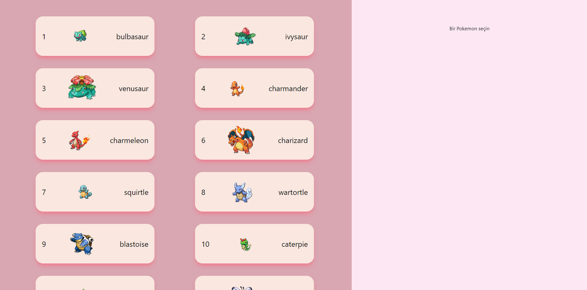
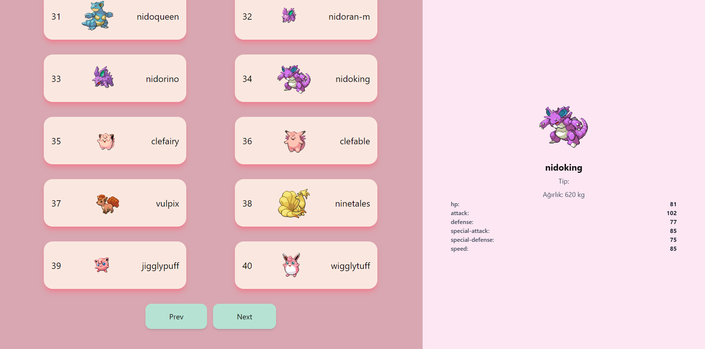

## PokeApi kullanarak küçük bir uygulama yaptım.

Çalıştırmak için:

```bash
npm start
```

projeyi çalıştırdıktan sonra [http://localhost:3000](http://localhost:3000) adresine giriniz

- PokeApi dökümantasyonu için [Api Documentation](https://pokeapi.co) adresini ziyaret edebilirsiniz 


